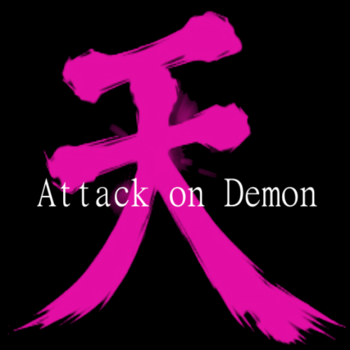
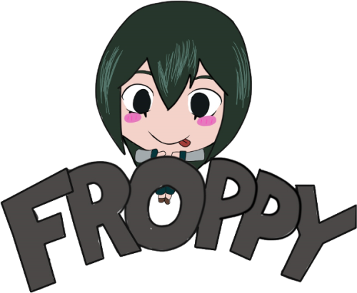
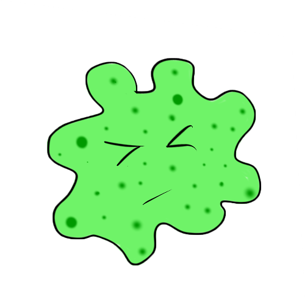
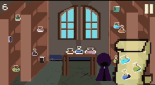
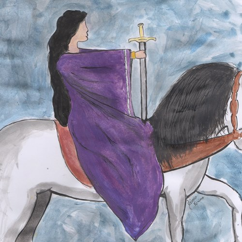
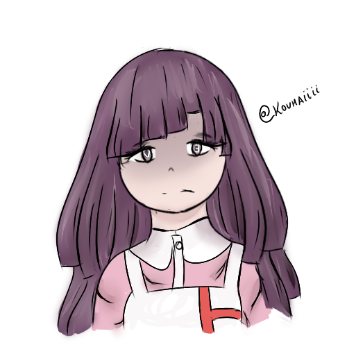
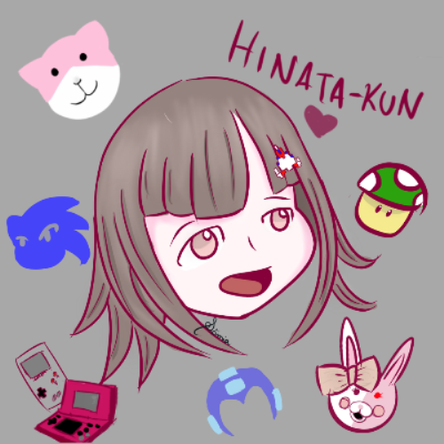
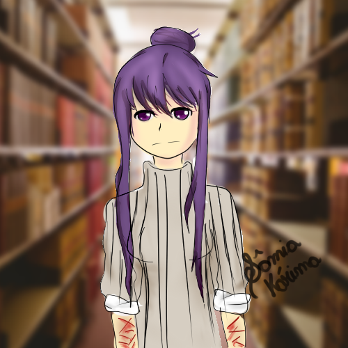

* * *
# Quem sou eu?  
Sâmia Kárima, 16y, Acadêmico em Programação de Jogos Digitais.  
**JUST MONIKA!** 

E-mail: samia.karima@hotmail.com  

  

* * *
# Portfólio

* * *
## Games
* * *
### Attack on Demon

* * *
### Froppy

  

* * *
### Elements: Origin of Matter.

  

* * *
### Bacterium.

* * *
### POISON (Game Mockup).

* * *
## Projetos de Jogos (EM ANDAMENTO)

### As Brumas de Avalon.

Tendo como base os 4 volumes dos livros escritos por Marion Zimmer Bradley, que narra a lenda arturiana com outra perspectiva.
Será um jogo em quebra cabeça, composto por ilustrações feitas com aquarela e guache.

* * *
## Artes
* * *

* * *
## Meu Mapa de Influência :D
* * *

